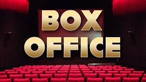
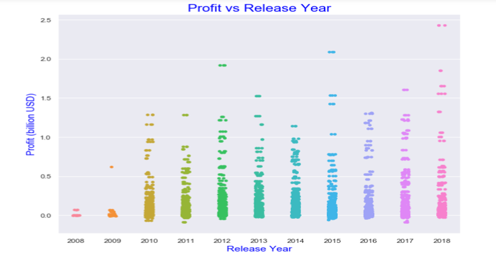
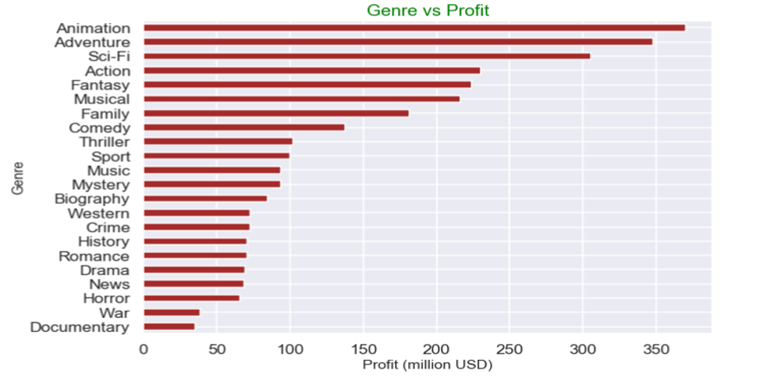
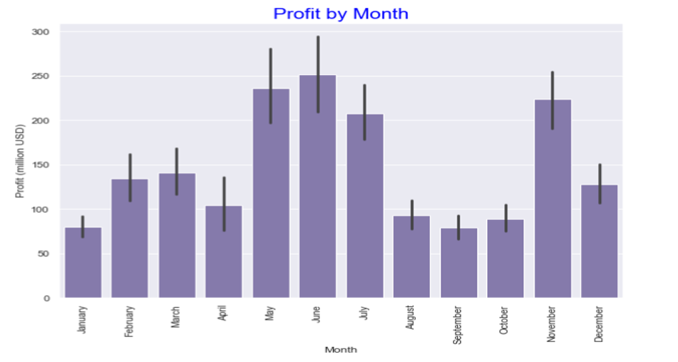
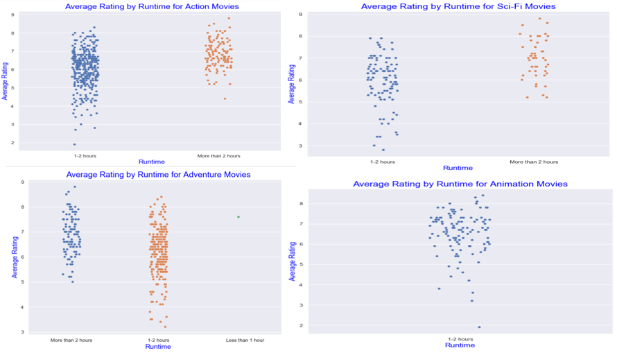

<h1 align="center">Box Office Analysis For Microsoft</h1>

Microsoft is planning to venture into Movie Business. But since this is going to be the very first for them, they need insight into this Business. The aim of this Project is to help them understand the Movie Business and the kind of movies that are being made. 

We decided to explore the data given to us and analyze the following

Q1- How has the trend of the Movie Industry been in the last decade?

Q2- What seasons bring out most profitable movies?

Q3- What are the most successful Genres?

Q4- What is the best season for each Genre?

Q5- What has been the trend of Movie runtime by Genre?

---

The Project outlines the data analysis performed for conclusions and recommendations. The data analysis performed in the Project  observes the yearly and monthly trends to guage popular release times and genres and uses gross profit as an indicator for consumer interest.

Cleaning the data sets given.

Merging the tn.movie_budgets.csv,title.basics.csv,title.ratings.csv and tmdb.movies.csv datasets.

Changing data type of 'Release Date' to reflect datetime and extracting year and months from it.

Use the merged datasets to start our analysis.

Grouping the movies for last 10 years.

Analyse the trend for Profit versus Release Year

Check the Correlation Between Production Budget and Profit

Gross Profit by Winter, Spring, Summer, and Fall for past decade

Gross Profit by different Genres

Monthly gross profit trend as a mean for past 10 years for comparison

Genre/Runtime analysis

<h1>Findings</h1>

<h1>Recommendations</h1>
The Production budget should be around 150 - 200 million USD.
Make an Action, Adventure, Sci-Fi or Animation movie which are our best genres.
The best season for the movies to release are during Summer or Spring.
The film should be around 2-3 hours and 1-2 hours if Animation.

